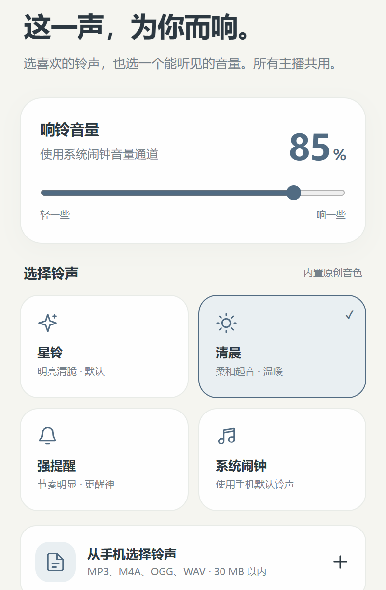

# VR闹钟 · 多主播版

为 B 站直播准备的开播闹钟。填入主播 UID（主页 `space.bilibili.com/` 后面那串数字）即可添加主播，也可以粘贴主页或直播间链接；选择想被提醒的时间、所在时区和喜欢的铃声，开启守候后检测直播状态。

**Android 8.0 及以上 · 当前版本 1.1.9（静音模式 · 高频时段检测）· 包名 `dev.hazel.livealarm.multi`**

## 来源与致谢

本项目基于青雾（[@Acetaffy1883Hzm](https://github.com/Acetaffy1883Hzm)）的 **[满区闹钟 ManquAlarm-](https://github.com/Acetaffy1883Hzm/ManquAlarm-)** 改造：保留其守候服务、提醒规则与可靠性设计，扩展出多主播守候、周表、AI 识别与外观自定义等能力（完整变更见 [更新说明](CHANGELOG.md)）。感谢原作者的代码与设计；上游单主播版本仍在原仓库以 1.0.x 发布。

- 上游原仓库：<https://github.com/Acetaffy1883Hzm/ManquAlarm->
- 本项目的全部代码、文档与界面迭代由 **GLM-5.3-Flash**（智谱 Z.ai，经 ZCode）与 **DeepSeek-V4.1-Flash** 协作完成：前者完成主体实现，后者承担后续的缺陷修复、版式调整与发布维护。
- 本仓库当前版本：**1.1.0808（满区版）**（安装包内 `1.1.8`／`versionCode 40`）：相对 1.1.6 加入**桌面小宠物「满区」**（形象来自 B 站 up 主 贰三3三 的视频《大大方方的桌泽满灰宠》，详见 [素材来源](#素材来源)），首页「打开直播间」改为两段式，并修好了周表的「正在直播」判定、周表图片换图不生效、全屏提醒页「去直播间」点不动三个问题。（1.1.0 首次公开时已并入内部迭代 1.1.0–1.4.3 的全部能力；更早的公开版本见 [更新说明](CHANGELOG.md)）

- **1.1.9**（安装包内 `1.1.9`／`versionCode 41`）新增两个功能：
  - **静音模式**（「声音」页）：开会、上课这类场合可以让闹钟照常全屏提醒、照常发通知，只是**不响铃、不振动**。可选 30 分钟／1 小时／2 小时／直到手动恢复，前三档到点自动恢复响铃；静音存的是「到期时刻」而不是开关，忘记关掉也会自己结束，且不会停止检测。
  - **高频时段检测**（首页开关，默认关闭）：只在你圈定的高频时段按设定的检测间隔守着（默认 08:00–12:00、14:00–16:00、20:00–00:00），**其余时间放慢到每 2 分钟一次**省电，适合白天守着、夜里省电；高频时段可在「时段」页按提醒时段的方式自行增删改。
  - 这一版还带上了 1.1.0808 之后的其余改动：**16 位 UID 支持**（新账号的 UID 已有 16 位，此前无法添加；同时修好了大号 UID 在界面里被悄悄改写的问题）、**时段之外守候整体暂停**（时段外不联网、不检测、不加唤醒）、打开「通知与运行记录」时的**闪屏**修复。

本应用与上游使用**不同包名**（`dev.hazel.livealarm.multi` vs `dev.hazel.livealarm`），可与上游原版并存安装，设置互不影响。

[更新说明](CHANGELOG.md) · [使用指南（权限设置）](docs/GUIDE.md) · [使用说明](docs/USAGE.md) · [构建方法](docs/BUILDING.md) · [数据说明](docs/PRIVACY.md) · [测试记录](docs/TESTING.md)

## 能做什么

- **多主播守候**：**填入主播 UID**（主页 `space.bilibili.com/` 后面那串数字，9～10 位或新账号的 16 位），或直接粘贴主播主页链接（space.bilibili.com/…）、直播间链接（live.bilibili.com/…）即可添加，自动识别名称与头像，最多 16 位；每位主播独立「检测」与「响铃」开关，可只关注不响铃。
- **桌面小宠物**：底部来回走的小宠物，走起来会朝行进方向侧身、偶尔自己跳一下；款式有「**满区**」（默认）与「绿冻」两只，可在设置里关闭（关闭后底部留白自动收回）。它只在应用可见时活动，点击穿透，不会挡住按钮。形象来源见 [素材来源](#素材来源)。
- **开播响铃**：循环使用闹钟音量通道，支持渐强、振动、自动停止和稍后提醒；轮播不会当作开播。同一时间只响一次，其余主播开播写入记录（可选接续响铃队列）。
- **选自己的声音**：星铃、清晨、强提醒、系统闹钟铃声，或导入最多 30 MB 的本地音频。所有主播共用。
- **自由设定时段**：最多 32 个时间段，按星期重复，支持凌晨和跨午夜；可选择严格按开播时间提醒，或补报已在直播的场次。时段由所有主播共用。**时段之外守候会自动暂停**：不检测、不联网，进入时段时自动恢复。
- **直播周表时间线**：逐条添加、粘贴文字识别、AI 识别图片或上传对照，记录各主播一周的直播安排；「周表」页按天展示，正在直播的主播亮起并显示封面；开播前自动提速检测，可提前 5 分钟预告。
- **开播统计**：按主播记录每场开播与结束，卡片显示「本周 N 场 · 近 30 天 N 场」。
- **桌面小组件**：守候状态、正在直播的主播、下一次周表预告与上次检测时间直接放在桌面。
- **外观自定义**：12 色主题色板与自定义 HEX、AMOLED 纯黑模式、自选背景图片（遮罩与卡片不透明度可调）、可从最近任务隐藏缩略图。
- **海外也能选时间**：默认跟随手机，也可搜索并固定 IANA 时区，按该地区规则处理夏令时。
- **后台守候**：前台服务与持续通知、断网重试、访问限制退避、检测保活闹钟、每 15 分钟看门狗、重启恢复、定时恢复检查；无障碍恢复辅助可选。可在“守候”页看到服务心跳是否中断。
- **本地记录与备份**：查看最近记录，导出或导入设置与主播列表，主动导出通知诊断；AI 密钥与背景图片不会进入备份。

普通使用无需 Root、Shizuku 或电脑。它是粉丝制作的非官方应用，没有 B 站或主播的官方背书。

*页面截图来自使用模拟 Android 通信的界面测试。*

## 开始使用

1. 从 [Releases](../../releases) 下载 APK 安装，或自行构建（见 [构建方法](docs/BUILDING.md)）。独立包名，可与上游原版并存。
2. 在“主播”中填入主播 UID，添加想被提醒的主播；在“时段”中设定提醒范围与时区，在“声音”中选择铃声和音量。
3. 按着 [使用指南](docs/GUIDE.md) 把通知、电池、自启动等权限设置对——闹钟响不响，权限说了算。
4. 先做一次声音测试，再做一次锁屏测试；开启守候后检查系统通知栏中的守候通知。

> 新装应用不会继承其他应用的授权。请在系统设置中为「VR闹钟」单独允许通知、允许自启动，并把电池策略设为“不限制”；在最近任务中锁定卡片可避免划掉后台被系统强杀。

## 关于后台保活

守候依靠前台服务、每轮检测自排的保活闹钟、15 分钟看门狗、重启恢复与定时恢复检查层层兜底；守候页直接显示服务心跳与最近中断记录。

**但划掉后台是系统级强杀，应用无法否决。** 在小米/澎湃等系统上，从最近任务划掉应用会让前台服务、权限与恢复用的闹钟一起失效，必须由用户在系统里配好三件事：允许自启动、电池设为“不限制”、并在最近任务里长按卡片**锁定**本应用。应用会把每次真实中断（检测比计划晚 5 分钟以上）记入记录页，用于判断系统是否连恢复用的闹钟都没有投递；同时守候页提供「开启无障碍守候辅助」入口——无障碍服务由系统自行重新绑定，是划掉后台后恢复最快的一条路。

用户明确开启“通知异常时仍响铃”后，可尝试兼容声音提醒；这不会让系统通知权限变成已授权。

## 使用边界

- 直接检测 B 站公开接口，无云端推送；提醒延迟受检测间隔、网络、接口状态和手机后台策略影响。
- 强行停止、关机、断网、系统省电限制均可能中断提醒；无障碍辅助不能保证永久保活。
- 全屏、锁屏、勿扰模式和耳机路由由系统控制。海外网络能否访问接口需以当地实际情况为准。
- AI 识别为可选功能：只有你主动点按时，那一张周表图片才会上传到你自己在设置里填写的 AI 服务商；不配置密钥则该功能不工作。
- 界面与规则已通过自动化测试，未覆盖所有机型、真实开播、长期锁屏和耗电场景。具体范围见 [验证记录](docs/TESTING.md)。
- **本质是 AI 拼好钟，切勿盲目信任。** 本项目（含代码、文档与界面）全部由 GLM-5.3-Flash 与 DeepSeek-V4.1-Flash 生成与迭代，处于试运行阶段，未经长期真机验证；请勿把它当作唯一或关键的提醒手段，重要场次建议自行留意或设置备用闹钟。

## 素材来源

- **桌面小宠物的形象**（「满区」与「绿冻」）来自 B 站 up 主 **贰三3三** 的视频 **《大大方方的桌泽满灰宠》**：<https://www.bilibili.com/video/BV1mMuu6wESX/>。本项目把该形象做成了应用内的两只小宠物（「满区」由截取的立绘抠底后切成「头＋围脖」两层来驱动摆动），**形象版权归原作者**，随应用提供不代表可以商用或再分发；如果作者不希望被这样使用，请联系我下架。
- 其余界面图形为项目自绘或由代码生成（图标均为矢量路径，应用图标由 `tools/make_launcher_icon.py` 从 `app/src/main/assets/hazel.png` 烘焙生成）。

## 版权与许可

- 上游“满区闹钟（ManquAlarm-）”代码版权归原作者**青雾**所有；本仓库是其衍生项目，发布安排与原作者约定，许可证文本见 [LICENSE](LICENSE)。
- 桌面小宠物的形象版权归其原作者（B 站 up 主 贰三3三，见 [素材来源](#素材来源)）；图标与其余角色素材来自项目提供者。仓库公开不代表这些素材可以任意商用，也不改变其原有权利归属。

## 开发与反馈

Android 原生 Java 负责检测、服务、音频和权限；界面使用 APK 内的离线 WebView 资源。构建环境与测试命令见 [BUILDING](docs/BUILDING.md)。

提交问题时提供应用版本、手机型号、Android/系统版本和复现步骤。公开 Issue 优先附设置页状态截图；完整系统日志和包含系统组件 APK 的诊断包不要直接公开，详见 [数据说明](docs/PRIVACY.md)。
